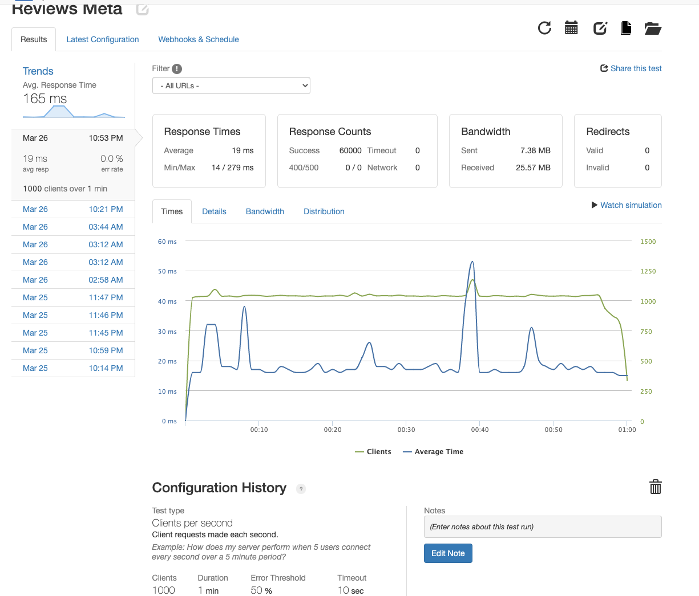

# Agile Creations Reviews API

For this project I worked with a team of engineers on the systems design of an eccomerce platform. I was given the legacy code base for the front end to this platform, and I was required to design the schema, create the server/database, and migrate millions of lines of data into the new database, and then deploy and scale it to handle production level traffic.

I was responsible for the reviews section of this platform, in which users have the ability to review a product or search reviews about a product. I opted on using postgreSQL because our data was highly structured and was easy to query using a relational DBMS. Following the data migration, I deployed my server and database using AWS EC2 instances, containerizing my images with docker to ensure easy and swift scalability. I used nginx as a load balancer on a separate EC2 instance in order to reroute incoming traffic between all of my server instances.

# Technologies Utilized

<a href="https://www.postgresql.org/">postgreSQL</a>

<a href="https://loader.io//">loader.io</a>

<a href="https://www.docker.com/">docker</a>

<a href="https://newrelic.com/">new relic</a>

<a href="https://aws.amazon.com/">AWS</a>

<a href="https://www.nginx.com/">nginx</a>

# Schema Design

</img>

</img>

# Results

I stress tested using loader.io, similutating virtual users and pushing the bounds to see how much traffic my running server instances could handle. I used new relic to analyze the CPU utilization across server instances to address where my bottlenecking was occurring, whether that be in the server or the database. Once I reached up to 5 running instances of my server my throughput was 36000 rps with a 0% error rate and a 400ms response time. Once I added a 6th server instance and saw no change in optimization, I knew my bottlenecking was occuring in my queries. So I redesigned my queries and server to have nothing over linear time complexity. I also opted on switching from client to pool and making minor adjustments to my nginx configuration to allow my running server instances to handle up to 60000 rps!

</img>

 
